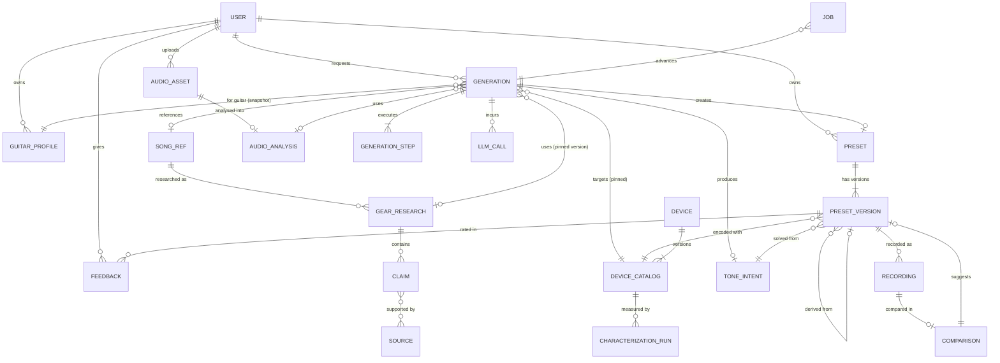
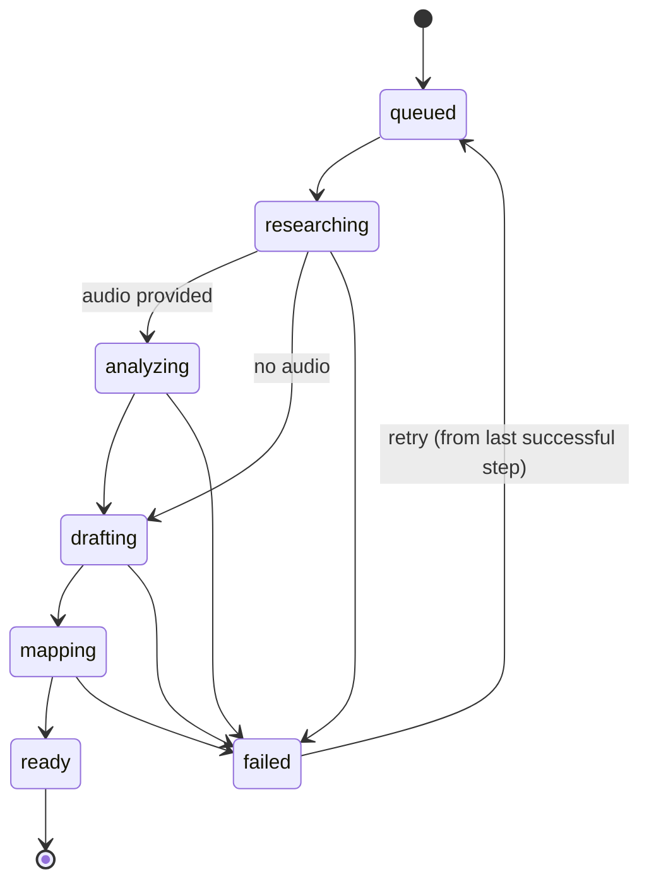

# Domain Model

## 1. Bounded contexts

| Context | Owns | Notes |
|---|---|---|
| **Catalog** | Device, catalog versions, models, parameters, semantics, characterization | Mostly static data + internal R&D measurements |
| **Reference** | SongRef, GearResearch, Claim, Source, AudioAsset, AudioAnalysis | Research is shared across users; audio is user-owned and short-lived |
| **Generation** | Generation, GenerationStep, ToneIntent, LlmCall, Job | The pipeline and its trace |
| **Presets** | Preset, PresetVersion, Recording, Comparison, Feedback | User-owned results and their evolution |
| **Accounts** | User, GuitarProfile, Quota | Auth is delegated; we store a user row keyed by the auth subject |

Contexts share IDs, not tables' internals. In code they are modules of one Python package with
import rules enforced by `import-linter` (see [repository](repository.md)).

## 2. ERD



## 3. Entities

| Entity | Key fields | Ownership / lifecycle |
|---|---|---|
| `user` | id (uuid), auth_subject (unique), created_at, plan, deleted_at | Created on first login; soft delete → hard delete of owned data after 30 days |
| `guitar_profile` | id, user_id, name, body_style, pickup_config (`SSS`,`HH`,`HSS`,`P90`…), default_pickup_position, tuning, notes | User-owned; snapshotted into each generation (JSON) |
| `song_ref` | id, mbid_recording, mbid_work, title, artist, normalized_key | Shared; created on first lookup |
| `gear_research` | id, song_ref_id, status, prompt_version, model, created_at, expires_at, review_state (`unreviewed`,`human_verified`) | Shared, immutable once completed; new version on refresh |
| `claim` | id, research_id, role, item_text, item_key (nullable, normalized gear key), statement, specificity (`this_recording`,`artist_general`), evidence_level, confidence | Immutable |
| `source` | id, url, publisher, title, retrieved_at, content_hash | Shared, deduplicated by URL+hash |
| `claim_source` | claim_id, source_id, quote_excerpt (≤ 25 words), quote_hash, verified (bool) | |
| `audio_asset` | id, user_id, storage_key, sha256, mime, duration_s, purpose (`reference`,`recording`), retention_expires_at, deleted_at | User-owned; **raw audio deleted ≤ 24 h** |
| `audio_analysis` | id, audio_asset_id, analyzer_version, window, separation_method, features (jsonb), created_at | Kept (derived data only) |
| `generation` | id, user_id, status, mode (`song`,`song+audio`,`audio`), inputs (jsonb), device_catalog_id, pipeline_version, trace_id, cost_usd, error, created_at, finished_at | User-owned; aggregate root of the pipeline |
| `generation_step` | generation_id, step, status, attempt, started_at, finished_at, output_ref / output (jsonb), error | Append-only |
| `tone_intent` | id, generation_id, parent_intent_id, intent (jsonb, schema-versioned), source (`llm`,`user_edit`,`rules`) | Immutable versions |
| `preset` | id, user_id, device_id, title, current_version_id, created_at | User-owned |
| `preset_version` | id, preset_id, version_no, parent_version_id, tone_intent_id, device_catalog_id, patch (jsonb), prst_sha256, created_by (`generator`,`user_edit`,`match`), created_at | **Immutable**; `(preset_id, version_no)` unique |
| `recording` | id, preset_version_id, audio_analysis_id, notes | User-owned |
| `comparison` | id, reference_analysis_id, recording_analysis_id, metrics (jsonb), suggestions (jsonb), suggested_version_id | |
| `feedback` | id, user_id, preset_version_id, usefulness (1–5), closeness (1–5), tags[], text, created_at | |
| `llm_call` | id, generation_id, step, provider, model, prompt_version, input/output/cache tokens, cost_usd, latency_ms, request_hash, response_excerpt, created_at | 30-day retention for bodies; metrics kept |
| `job` | id, kind, generation_id, status, run_after, attempts, max_attempts, locked_by, locked_at, last_error, payload (jsonb) | Deleted 7 days after completion |
| `device` | id, key (`valeton_gp180`), vendor, name | Static |
| `device_catalog` | id, device_id, firmware, source_suite_version, catalog_version, data (jsonb), created_at | Immutable versions |
| `characterization_run` | id, device_catalog_id, model_key, params (jsonb), di_clip_id, features (jsonb), rig_config, measured_at | Internal R&D |
| `quota_usage` | user_id, day, generations, llm_cost_usd | Rate limits / budgets |

## 4. Important indexes

```sql
create unique index on "user"(auth_subject);
create index on generation(user_id, created_at desc);
create index job_ready on job(run_after) where status = 'queued';
create unique index on generation_step(generation_id, step, attempt);
create unique index on song_ref(mbid_recording) where mbid_recording is not null;
create unique index on song_ref(normalized_key);
create index research_latest on gear_research(song_ref_id, created_at desc) where status = 'completed';
create index on claim(research_id);
create unique index on preset_version(preset_id, version_no);
create index on preset(user_id, created_at desc);
create index audio_expiry on audio_asset(retention_expires_at) where deleted_at is null;
create index on llm_call(generation_id);
create index on characterization_run(device_catalog_id, model_key);
```

## 5. Versioning strategy

- **Immutable facts, versioned rows.** `gear_research`, `tone_intent`, `preset_version`,
  `device_catalog`, `audio_analysis` are never updated in place; changes create new rows linked to
  their parent.
- **Pinning.** A generation pins the research version, catalog version, analyzer version, prompt
  versions and pipeline version it used → reproducible.
- **JSON schema versions.** `intent` and `patch` jsonb carry `schema_version`; migrations are
  code-level upcasters, not in-place data rewrites.
- **Device firmware change** → new `device_catalog`; existing preset versions keep their catalog;
  re-targeting creates a new preset version.

## 6. Generation lifecycle



## 7. Authorization rules

- Every user-owned row carries `user_id`; all queries go through repository functions that require
  the caller's `user_id` (no unscoped queries in request handlers). Postgres row-level security is
  enabled as defence in depth if Supabase is used.
- Shared rows (`song_ref`, `gear_research`, `claim`, `source`) are readable by any authenticated
  user, writable only by the worker role.
