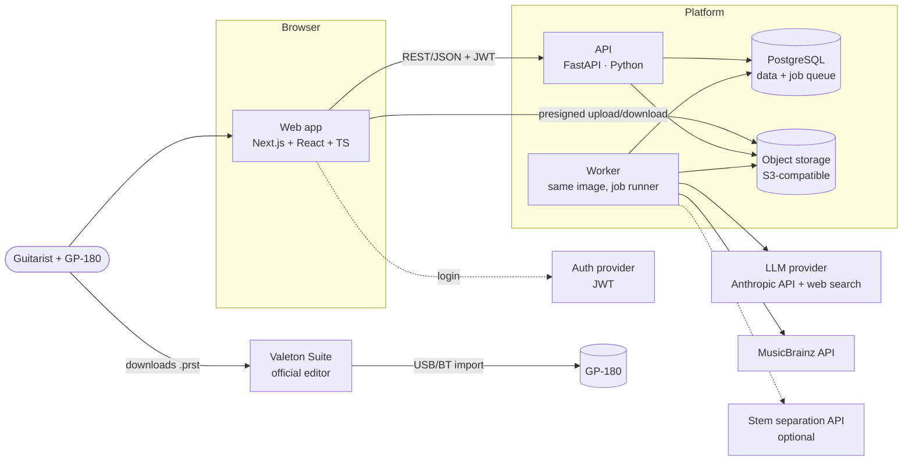

# System Architecture

Decision records: [ADR-006](../decisions/ADR-006-system-architecture.md),
[ADR-007](../decisions/ADR-007-hosting.md), [ADR-011](../decisions/ADR-011-polyrepo-backend-and-web.md),
[ADR-012](../decisions/ADR-012-nextjs-frontend.md).

Two repositories: **`toneprofile`** (this one: Next.js web app + all documentation) and
**`toneprofile-api`** (planned: Python backend — API, worker, device engine), connected by a
versioned OpenAPI contract. See [repositories](repository.md).

## 1. Drivers

1. Solo developer (plus a physical GP-180) → minimise moving parts and vendors.
2. Heavy lifting is Python-native: DSP, ML, binary codec, optimization.
3. Work is short-lived but CPU-heavy (10–120 s per generation) → async jobs.
4. Costs must scale to zero-ish at low volume.
5. Must run end-to-end locally with `docker compose up`.
6. Device-independent core so more devices can be added later without a rewrite.

## 2. Architecture options compared

| | A. Mostly serverless (Next.js + serverless functions + managed queue) | B. Next.js + serverless API + container workers (brief's hypothesis) | **C. Modular monolith: Python API + worker (one image), SPA frontend** | D. Fully containerized incl. frontend server | E. Local-first desktop app |
|---|---|---|---|---|---|
| Dev complexity | Medium: audio libs don't fit function limits; two languages for domain | High: domain split across TS API and Python workers | **Low: one domain language, one codebase** | Low–medium | Medium (packaging) |
| Cost at low volume | Lowest | Low | Low (scale-to-zero machines) | Low–medium | Near zero |
| Audio processing | Poor (package size, timeouts, no ffmpeg control) | Good | **Good** | Good | Good (user CPU) |
| GPU | External service | External or GPU workers | External service behind a port | Same | User GPU |
| Cold starts | Frequent | API: some; workers: yes | Worker: seconds (acceptable, async) | Same | None |
| Ops complexity | Low infra, high glue | Highest (3 runtimes, queue) | **Low** | Medium | Distribution/updates |
| Vendor lock-in | High | Medium | Low (containers + Postgres + S3 API) | Low | Low |
| Local dev | Emulators | Compose + Next.js | **Compose** | Compose | Native |
| Future growth | Rewrite likely | OK | Split worker types/services when needed | OK | Poor for SaaS |

**Choice: C.** The brief's hypothesis (B) splits the domain model across TypeScript and Python and
adds Redis for a queue that Postgres can handle at our scale. A local-first app (E) is attractive
for hardware integration but premature before the core loop is proven; the Python core keeps that
option open (it could ship as a local helper later for Web MIDI/USB features).

## 3. Container view

## 4. Synchronous vs asynchronous

| Operation | Mode | Why |
|---|---|---|
| Auth, CRUD (presets, history, feedback) | Sync | < 100 ms |
| Create generation | Sync request → **async job** | Returns `generation_id` immediately |
| Song lookup/autocomplete | Sync (MusicBrainz, cached) | Interactive |
| Upload | Direct-to-storage via presigned URL | Keeps API out of the data path |
| Audio probe/decode/separate/analyse | Async | 5–120 s CPU |
| Gear research | Async (cached per song) | 10–60 s with web search |
| Intent drafting + mapping + serialization | Async (same job, subsequent steps) | Seconds |
| Re-map after user edits intent/patch | Sync (≤ 1 s, deterministic) | Interactive editing |
| `.prst` download | Sync | Deterministic from stored patch |
| Match: compare recording | Async | Audio processing |
| Progress | Web app polls `GET /generations/{id}` at `poll_after_ms` (SSE later) | Simple and robust |

## 5. What is serverless vs containerized

| Component | Runtime |
|---|---|
| Web app | Next.js: static marketing pages + app shell; locale proxy; rewrites to the API |
| API | Container (scale-to-zero capable machine) |
| Worker | Container, same image, `toneprofile worker` entrypoint; scale by queue depth |
| Postgres, object storage, auth | Managed services |
| LLM, optional separation/GPU | External APIs behind ports |

## 6. Job execution

- Queue = `job` table in Postgres, claimed with `SELECT … FOR UPDATE SKIP LOCKED`; retries with
  exponential backoff; idempotent steps keyed by `(generation_id, step)`.
- A generation is a small state machine: `queued → researching → analyzing → drafting → mapping →
  ready | failed`, with each step persisted (`generation_step`) so failures resume from the last
  successful step.
- Redis is not needed at MVP scale (≪ 100 jobs/min). Revisit only if queue latency or throughput
  measurements demand it.

## 7. Frontend

**Next.js 16 (App Router) used strictly as a frontend** — [ADR-012](../decisions/ADR-012-nextjs-frontend.md)
supersedes the original Vite SPA choice because the marketing experience (static pages, SEO,
localized metadata, fonts) became a first-class surface. Next.js holds no domain logic and makes no
LLM calls; `/api/v1/*` is rewritten to the Python API.

Full details: [frontend architecture](../frontend/frontend-architecture.md) ·
[design system](../frontend/design-system.md) · [creative direction](../frontend/creative-direction.md) ·
[UX architecture](../product/ux-architecture.md).

### MVP screens

| Screen | Purpose |
|---|---|
| Landing | What it is, honest limits, device support |
| Sign in | Guest mode until the backend exists; auth provider later (P6) |
| New tone | Song search (MusicBrainz), optional excerpt upload + window selection, guitar profile, section/style |
| Generation progress | Step timeline (research, audio, intent, mapping) |
| Result | Tone summary with evidence badges & sources; signal chain; per-block parameters; alternatives; explanation; **Download .prst**; dial-in sheet; import instructions |
| Edit (P1) | Intent-level edits (re-solve) and patch-level edits (direct), versioned |
| Match (P1) | Upload a GP-180 recording → suggested adjustments → new version |
| History | Generations and preset versions |
| Feedback | Rating + tags per preset version |
| Admin (internal, with backend) | Generation trace, LLM calls, costs, eval runs |

## 8. Infrastructure (MVP)

| Concern | Choice | Alternative |
|---|---|---|
| Web hosting | Vercel (native Next.js) | Cloudflare via OpenNext, Netlify, a container |
| API + worker | Fly.io Machines (one Docker image, two process groups) | Railway, Render, a Hetzner VPS with Compose |
| Database | Supabase Postgres (plain Postgres, portable) | Neon |
| Auth | Supabase Auth (JWT verified in FastAPI) | Clerk, Auth0 |
| Object storage | Supabase Storage (S3-compatible) or Cloudflare R2 | S3 |
| Secrets | Fly secrets / GitHub Actions secrets | Doppler |
| Errors | Sentry (free tier) | — |
| Traces/metrics/logs | OpenTelemetry → Grafana Cloud free tier | Honeycomb |
| CI/CD | GitHub Actions | — |

Local: this repository runs `npm run dev` (mock mode needs no backend); the backend repository will
run `docker compose up` → postgres, minio (S3), api, worker, and the web app points at it with
`NEXT_PUBLIC_API_MODE=http`. A local JWT issuer stub replaces the
auth provider; LLM keys from `.env` (or `LLM_PROVIDER=recorded` to replay fixtures offline).

## 9. Observability

See [observability](observability.md).

## 10. Evolution path

- More devices → new `devices/<vendor_model>` package (catalog + codec + mapper); intent layer
  unchanged.
- Throughput → separate worker pools (audio vs LLM), GPU separation service.
- Direct-to-device → Web MIDI in the web app once the SysEx write path is proven (no backend change).
- Public preset library/marketplace → new bounded context; not in MVP.
